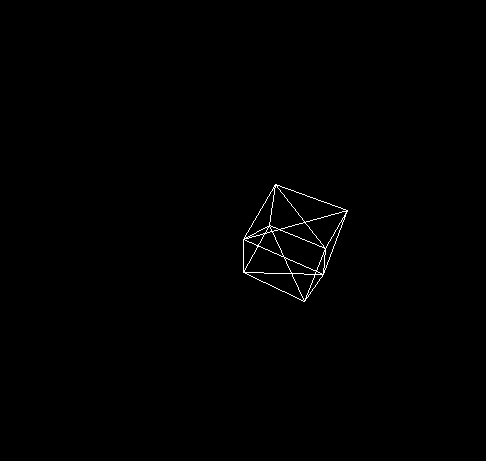

A simple c++ project to learn about rasterization.

This was part of an independent research project for my linear algebra class.
Also my first time using C++.

Based on [javidx9's tutorial](https://www.youtube.com/watch?v=ih20l3pJoeU) on 3d graphics, but uses SDL for rendering.